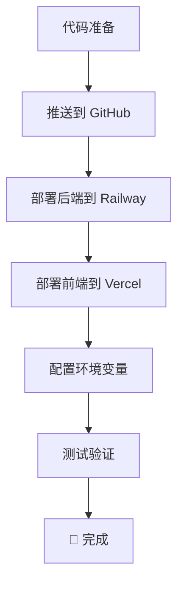

# 🚀 部署准备清单

## ✅ 已完成的工作

以下文件已为你创建，用于线上部署：

### 1. **部署配置文件**
- ✅ `vercel.json` - Vercel 部署配置
- ✅ `railway.json` - Railway 部署配置
- ✅ `nixpacks.toml` - Nixpacks 构建配置
- ✅ `Dockerfile` - Docker 容器化部署

### 2. **环境配置模板**
- ✅ `backend/.env.production` - 后端生产环境配置
- ✅ `frontend/.env.production` - 前端生产环境配置

### 3. **部署文档**
- ✅ `DEPLOYMENT.md` - 完整部署指南（详细版）
- ✅ `QUICK_DEPLOY.md` - 快速部署指南（5 分钟上线）
- ✅ `deploy-check.bat` - 部署检查工具

### 4. **Git 配置**
- ✅ `.gitignore` - 已更新，排除敏感文件

---

## 🎯 下一步操作

### 方案 A：跟着 QUICK_DEPLOY.md 快速部署（推荐）

```bash
# 1. 打开快速部署指南
start QUICK_DEPLOY.md

# 2. 运行部署检查
npm run deploy:check
```

### 方案 B：查看详细部署文档

```bash
# 打开完整部署指南
start DEPLOYMENT.md
```

---

## 📋 部署流程概览



---

## ⚡ 快速开始（3 个步骤）

### 1️⃣ 推送到 GitHub

```bash
git init
git add .
git commit -m "准备部署"
git remote add origin https://github.com/你的用户名/bilibili-analyzer.git
git push -u origin main
```

### 2️⃣ 部署后端

访问：https://railway.app
- 连接 GitHub
- 选择项目
- 自动构建
- 配置环境变量

### 3️⃣ 部署前端

访问：https://vercel.com
- Import 项目
- 设置 API URL
- Deploy

---

## 🔑 环境变量配置

### 后端环境变量（Railway）
```env
PORT=3001
CORS_ORIGIN=https://your-app.vercel.app
BILIBILI_COOKIE=你的B站Cookie（推荐配置）
```

### 前端环境变量（Vercel）
```env
VITE_API_URL=https://your-backend.railway.app
```

---

## 🆘 需要帮助？

1. **运行检查工具**
   ```bash
   deploy-check.bat
   ```

2. **查看快速指南**
   ```bash
   start QUICK_DEPLOY.md
   ```

3. **查看完整指南**
   ```bash
   start DEPLOYMENT.md
   ```

---

## 💡 提示

- ✅ 所有配置文件已创建
- ✅ 部署脚本已准备
- ✅ 文档已就绪
- ⏳ 现在只需按照步骤操作即可

**预计部署时间**: 10 分钟  
**费用**: $0（免费额度）

---

准备好就开始吧！🚀
